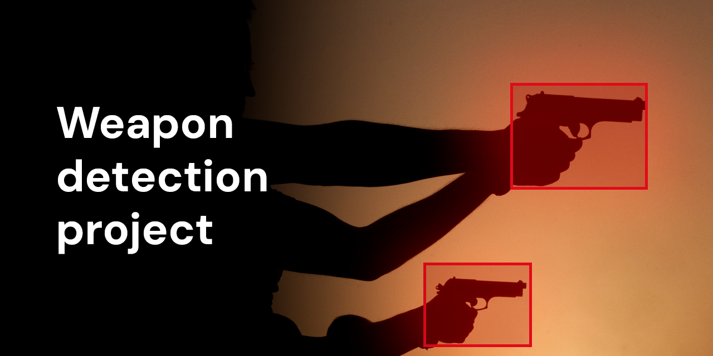
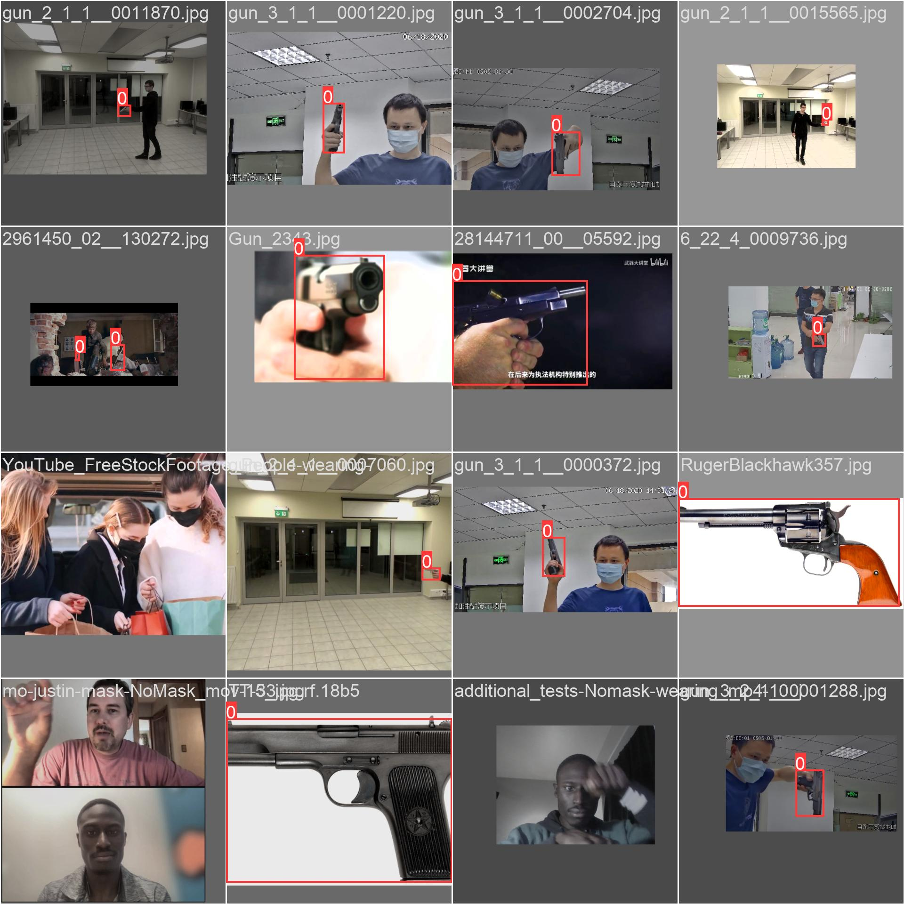

# Weapon detection project.

Click on the picture to view a demonstration of the model's work on some videos from YouTube.\
The first version of the model was trained on 6427 images over 100 epochs.\
**Stack:** YOLOv8, OpenCV. 
### Score
**mAP50:** 0.942\
**Precision:** 0.918\
**Recall:** 0.899
### Dataset
The [original](https://arxiv.org/abs/2105.01058) dataset was created by Delong Qi, Weijun Tan, Zhifu Liu, Qi Yao, Jingfeng Liu.\
Some background pictures were added to it, and some screenshots from real videos on YouTube.\
The data includes 6427 train (81.14%), 997 val (12.59%) and 497 test (6.27%) images.\
In the future, the model will be trained on the whole dataset (51K images).\
**Image examples:**

